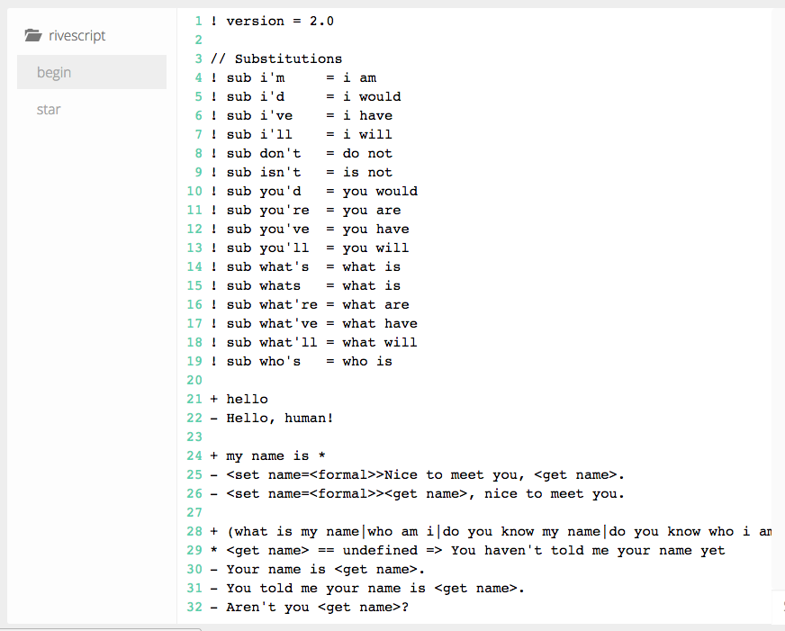

# Tutorial

This tutorial will show you how easy it is to build a "hello world" bot using the Messenger and RiveScript modules. RiveScript is a simple and powerful scripting language for chatbots, and if it's your first time using it, we recommend reading the [official documentation](https://www.rivescript.com/). 

This exercise should take you less than 10 minutes, without writing a single line of code. If you have any problems, don't hesitate to talk to us on our [Public Community](https://slack.botpress.io). It will be a pleasure for us to answer your requests.

## Requirements

Botpress requires [node](https://nodejs.org) (version >= 4.2) and uses [npm](https://www.npmjs.com) as package manager.

## Step-by-step

### 1. Install

You first need to have `botpress` installed as a general dependency using `npm`. If `npm` is already installed, you can install Botpress with the following command (make sure to install it globally):

```
npm install -g botpress
```

### 2. Create a new repository

Once `botpress` has been installed, you create a new repository and cd into it.

```js
mkdir hello-world-rivescript-bot && cd hello-world-rivescript-bot // Mac and Linux users

md hello-world-rivescript-bot && cd hello-world-rivescript-bot // Windows users
```

### 3. Initialization

Now, let's use the command line interface of `botpress` to initialize your bot:

```
botpress init
```

### 4. Install modules

In your command line again, you need to install the [botpress-messenger](https://github.com/botpress/botpress-messenger) module to be able to connect your bot to your Facebook page.

```
botpress install messenger rivescript
```

### 5. Start

Once everything is installed, you can start your bot and see what it includes.

```
botpress start
```

A local instance of your bot should be running at [http://localhost:3000](http://localhost:3000). From there you can install other modules as desired, but for this tutorial we only need `botpress-messenger` which we have just installed.

### 6. Configure Messenger connection settings

First, you will need to configure Messenger so it's connected directly to your Facebook page. If this is your first time to configure Messenger, we recommend following our [getting started](https://docs.botpress.io/getting-started.html) guide in the official Botpress documentation.


Briefly, you need to create a [Facebook page](https://www.facebook.com/pages/create) if you don't already have one. You also need to create a new [Messenger Application](https://developers.facebook.com/) on Facebook. After that, you can find your **App ID**, **App Secret**, and **Token Access**, and paste them directly into the `botpress-messenger` module settings of the [Botpress user interface](http://localhost:3000/modules/botpress-messenger) running locally. Finally, you only need to activate [ngrok](https://ngrok.com/), and then validate and connect your bot.

### 7. Answer a hello world user statement

Next, you will add a basic answer to "hello world" in the [RiveScript module](http://localhost:3000/modules/botpress-rivescript) of the Botpress instance running locally. 

When you open the `botpress-rivescript` module, you see the `begin` file prepopulated with sample RiveScript code. Feel free to modify this code to customize the interaction of your chatbot.



In this tutorial, we want to specify the bot's response to a user's "hello world" message (or **trigger** in RiveScript parlance). To do this, you add the following lines to your `begin` file.

```
+ hello world
- Botpress Team is happy to know that you have try our bot!
```

Click the Save button  to save your code.

#### Testing your code

The `rivescript-module` enables you to rapidly test your code directly in Botpress. To do this, click the Go button to display a chat panel, and type your messages in field below.

Click the Stop button  to end testing.

#### Creating or deleting RiveScript files

You can create new files by clicking the File button , or delete them by clicking .


### 8. Specify open-ended triggers

Finally, RiveScript allows you to specify wildcards or open-ended triggers for user messages containing variable data. You can find an example already provided in the `star` file (below), or you can specify your own wildcards.

```
+ *
- I'm not sure how to reply to that. I only understand 'hello world'...
- I don't understand what you have said...
- Sorry, I have been built to only answer to 'hello world'.
```

## Have fun

Building a bot with the RiveScript module is as simple as that!

Feel free to fork our bot, send pull requests, clone it, send comments, ...

## Community

Pull requests are welcomed! We believe that it takes all of us to create something big and impactful.

There's a [Slack community](https://slack.botpress.io) where you are welcome to join us, ask questions, and even help others.

Get an invite and join us now! 👉[https://slack.botpress.io](https://slack.botpress.io)

## License

hello-world-bot is licensed under [AGPL-3.0](/LICENSE)
