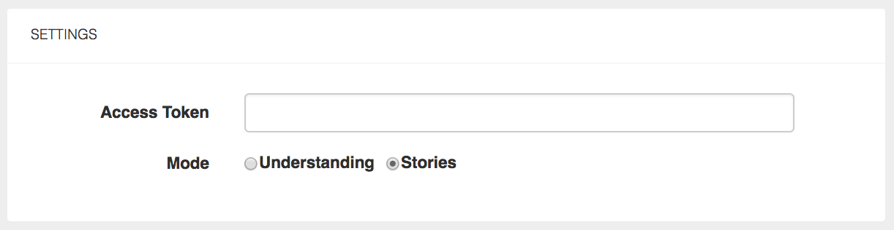
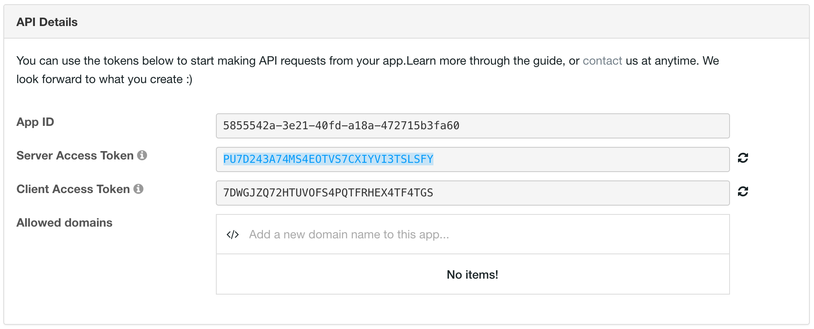
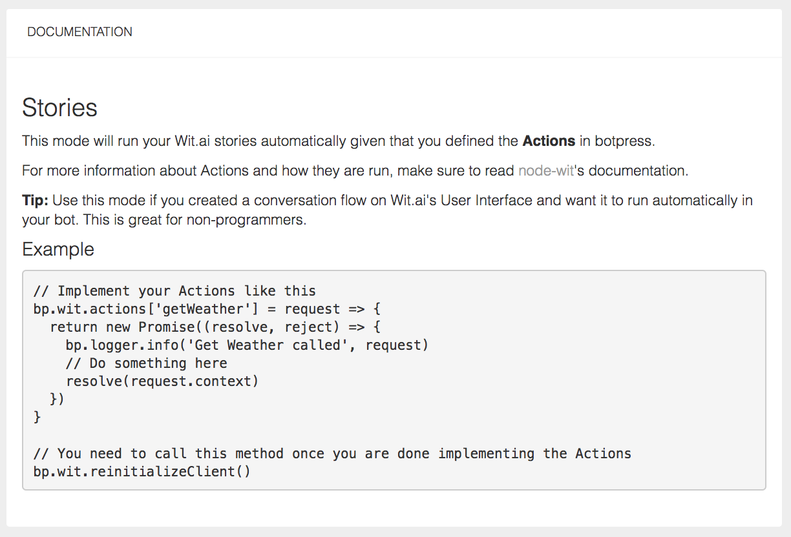
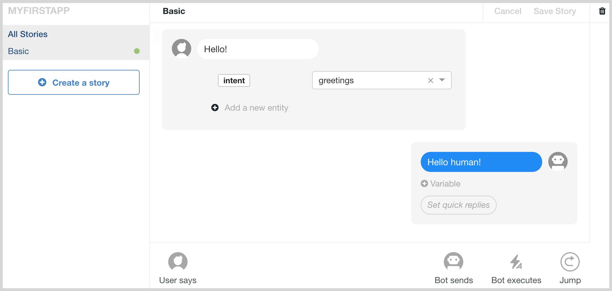
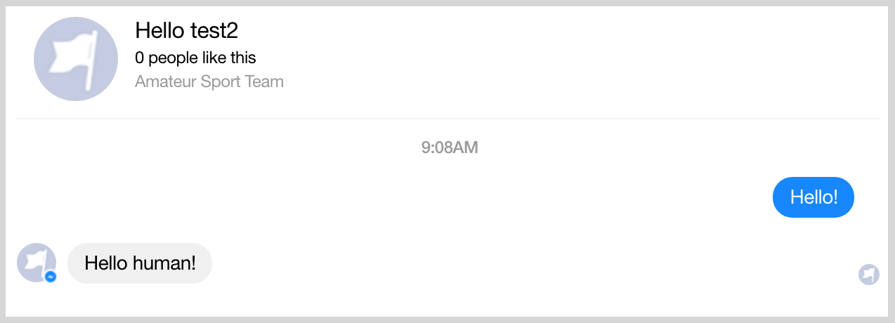

# Tutorial

This tutorial will show you how easy it is to build a bot using Messenger and Wit.ai. For this purpose, we will build a bot from scratch and we will end up with a simple weather bot in about 30 minutes. If you have any problem, do not hesitate to talk to us on our [Public Chatroom](https://gitter.im/botpress/core), it will be a pleasure for us to answer your requests.

If you don't want to follow up our step-by-step guide, you can clone this repository and just try it by linking it to a Facebook Page (Step #6) and you Wit.ai account (Step #7). If you clone the repository, don't forget to run `npm install` in your cloned repository.

## Requirements

Botpress requires [node](https://nodejs.org) (version >= 4.2) and uses [npm](https://www.npmjs.com) as package manager.

## Step-by-step

### 1. Install

First thing you need to have `botpress` installed as a general dependency using `npm`. If it's done yet, you only need to install it using the following command.

```
npm install -g botpress
```

### 2. Create a new repository

Once `botpress` has been installed, in your command line tool, you need to create a new repository and move into it.

```js
mkdir wit-bot && cd wit-bot // Mac and Linux users

md wit-bot && cd wit-bot // Windows users
```

### 3. Initialization

Now, let's simply use command line interface to initialize your bot. To do it, you need to run the following command.

```
botpress init
```

### 4. Install modules

Directly in your command line again, you need to install [botpress-messenger](https://github.com/botpress/botpress-messenger) module to connect your bot to a Facebook Page. Also, we will need (botpress-wit)[https://github.com/botpress/botpress-messenger to connect our bot to your Wit.ai account.

```
botpress install messenger wit
```

### 5. Start

Once you have everything installed, you can start your bot and see what have been installed on it.

```
botpress start
```

Go to http://localhost:3000 and from there you can install other modules if you want to, but for this tutorial we only need `botpress-messenger` and `botpress-wit` which are supposed to be already installed.

### 6. Configure Messenger connexion settings

Before starting coding it, we need to configure Messenger then it will be linked directly to your Facebook Page. To do this step, you can follow our [5 steps](https://github.com/botpress/botpress-messenger#get-started) guide in botpress-messenger documentation.


Briefly, you only need to create a [Facebook Page](https://www.facebook.com/pages/create) if you don't already have one and create a new [Messenger Application](https://developers.facebook.com/) on Facebook Developers Interface. After that, you need to find your **App ID**, **App Secret** and **Token Access**, and copy them directly in your web messenger [module interface](http://localhost:3000/modules/botpress-messenger). Finally, you only need to activate [**ngrok**](https://ngrok.com/), **validate** and **connect** your bot.


### 7. Configure your Wit.ai account

The next step is to link your `botpress-wit` module to your Wit.ai account. To do it, you only need to fill `Access token` field in the UI of the module.



First, you need to create an account on http://www.wit.ai if you don't already have one. Once your account is created, you now have to create a new application on Wit.ai, but by default, if you just created your account, you are supposed to already have one application initialize (MyFirstApp).

To find your access token, you need to go in **Settings** and in **API Details** panel, you will find it.



### 8. Select Wit.ai mode

You need to switch of mode in `botpress-wit` module to **stories**. As you probably notice, `botpress-wit` module offers two different modes: **understanding** and **story**.



**Note 1**: The **understanding** mode will inject understanding metadata inside incoming messages through the Wit.ai middleware. Events will have a wit property populated with the extracted entities and the context.

**Note 2**: The **stories** mode will run your Wit.ai stories automatically given that you defined the Actions in botpress. For more information about Actions and how they are run, make sure to read [node-wit's documentation](https://github.com/wit-ai/node-wit).

### 9. Begin a stories

Directly on Wit.ai, you will need to create a new story. First, we will begin by a simple _hello world_ to test if everything works from the beginning. You can create your own interaction to test the bot if you want to.



If everything works fine from the begin of the tutorial, your bot is supposed to work and answer to `Hello!` if you chat with it directly on [Messenger](https://www.messenger.com/) or [Facebook](https://www.facebook.com).




Open in editor

Once all the setup is done, we are now ready to code your bot. First thing you need to do is to open your repository with your favorite editor (Sublime, Atom, WebStorm, Netbeans...). As you can see, some files and directories have already been created when you initialize it before to accelerate development.

```js
- botfile.js // your bot's configuration. botpress uses this
- index.js // your bot's entry point. bot logic goes here
- package.json // regular node package.json file
- LICENSE // your bot license, either AGPLv3 or Botpress License
- .gitignore // ignoring some botpress-created files by default
```

### 8. Start coding

Now, open `index.js` file and write (or copy) those lines of code. In fact, this is a simple TODO list to add directly in your code.

```js
module.exports = function(bp) {
  bp.middlewares.load()

  /* Things to do:
    [ ] Basic welcome message
    [ ] Choose between 3 categories: WORK, PERSONAL DEVELOPMENT, GYM
    [ ] Choose random video in selected category
    [ ] Send video as Card (image, thumbnail, share button)
    [ ] Add small talk capabilities
    [ ] Catch-all sentences with quick_replies
  */
}
```

**Note:** When you are coding, using TODO is a good practice to adopt because it helps to stay focus and always be able to know exactly what you need to do next...

### 9. Basic welcome message

First, we will setup a basic answer to `GET_STARTED` button on Messenger. You simply need to add those lines in `index.js`.

```js
bp.hear({
  type: 'postback',
  text: 'GET_STARTED'
}, (event, next) => {
  const { first_name, last_name } = event.user
  bp.logger.info('New user:', first_name, last_name)
})
```

**Note**: When you click on **Get started** button on Messenger it emits a `postback` event and it's exactly what we are listening on here.

### 10. Import npm packages

To achieve easily all what we want to do, we will need some useful `npm packages`. Then, in your terminal, you will need to add them by using `npm install <package>` command.

```js
npm install bluebird  // https://bluebirdjs.com
npm install lodash    // https://lodash.com
npm install axios     // https://www.npmjs.com/package/axios
```

Once it's done, at the begin of your `index.js` file, you will need to import all of them.

```js
const Promise = require('bluebird')
const _ = require('lodash')
```

### 11. Choose between 3 categories

As you probably notice our first welcome message was a bit boring, let's customize it and add some humour to it.

```js
// ... (imports)

const pickCategory = {
  quick_replies: [
    {
      content_type: 'text',
      title: '🔥 Work 🔥',
      payload: 'GET_VIDEO_WORK'
    },
    {
      content_type: 'text',
      title: '😌 Life Goals 🔥',
      payload: 'GET_VIDEO_LIFE'
    },
    {
      content_type: 'text',
      title: '💪 Gym 🔥',
      payload: 'GET_VIDEO_GYM'
    }
  ],
  typing: true
}

module.exports = function(bp) {

  bp.hear({
    type: 'postback',
    text: 'GET_STARTED'
  }, (event, next) => {
    const { first_name, last_name } = event.user
    bp.logger.info('New user:', first_name, last_name)

    const WELCOME_SENTENCES = [
      "Hey there buddy pal, so I've heard that you need a little kick in the butt from time to time?",
      "Don't worry mate, that's my job and I'll do that for you.",
      "But man, I don't talk much.",
      "I'm a bit dumb, to be honest. Let's just stick to using buttons, that's going to be easier for the both of us."
    ]

    const WELCOME_TEXT_QUICK_REPLY = "THAT BEING SAID, choose a category right away and I'll make sure you get pumped up!"

    Promise.mapSeries(WELCOME_SENTENCES, txt => {
      bp.messenger.sendText(event.user.id, txt, { typing: true })
      return Promise.delay(4000)
    })
    .then(() => {
      bp.messenger.sendText(event.user.id, WELCOME_TEXT_QUICK_REPLY, pickCategory)
    })
  })
}
```

In this code, we use `Promise.mapSeries` to send ordered text messages with some delay between each. Also, we send a message at he end with some `quick_replies` added to ask to users which type of video they want to watch.

**Note**: You can try it if you want to, it's supposed to be working. The only thing you have to do before is to restart your bot by using again `bp start` in your terminal. Don't forget to save your changes before...

### 12. Basic answer

Now, we need to listen on `quick_reply` to know which kind of video users want to listen. Here is a simple example of code for listening to one type on video they might click on.

```js
bp.hear({
  type: 'quick_reply',
  text: 'GET_VIDEO_WORK'
}, (event, next) => {
  const PICK_TEXT = "Oh, yeah, work isn't always easy man. Let's fix that right away."
  bp.messenger.sendText(event.user.id, PICK_TEXT, { typing: true })
  Promise.delay(3000)
  .then(() => {
    bp.messenger.sendText(event.user.id, '<WORK_VIDEO>')
  })
})
```

**Note**: Actually, we only send a text message to validate that everything is working, but don't worry, during next steps, we will customize it to send awesome random videos about each topic.

### 13. Create a video file

To access videos from YouTube, you need to create a new file `video.js` and type (or copy) the following code. In fact, you need to import `axios` and `lodash`, create your own `videos` object which is a simple map containing multiple link selected for different categories and implement `getYoutubeVideoMetadata` function to grab metadata from YouTube API.

**Important**: You absolutely need to enter your own `<YOUTUBE_API_KEY>` if you want to grab video from YouTube. To do it, you can follow this detailed [guide](https://developers.google.com/youtube/v3/getting-started).

```js
const axios = require('axios')
const _ = require('lodash')

const videos = {
  WORK: [
    "DNFtCIzJQ7A",
    "g-fGYtagSDY",
    "00rPgc0tISM",
    "qa9G5EdKiRw",
    "3AyH1fBN7ac",
    "HQtZ4kud2qA",
    "puDQoBPpWyQ",
    "A0Scr2TW2ZA",
    "oonaeUiKV8Y",
    "2zzj4CO9xSw",
    "twZgNP8iZBQ",
    "8QlvQC4MXxs"
  ],
  LIFE: [
    "jE-Ajfd51aM",
    "6vuetQSwFW8",
    "7_R4AsV2fPI",
    "njQcOKOpFwk",
    "5g0QHTcwP8k",
    "t-H7_aAuiC8",
    "5e338_RFOr8",
    "U3V701IUZ2E",
    "ZkabeHig_r4",
    "FK16iXPRAjI",
    "4pxiU89O1wE",
    "2otRxX6y7mQ"
  ],
  GYM: [
    "Fh-rCrREEgA",
    "xoXYe9e01_Y",
    "hV63DbQ_qSc",
    "YxzQ6umhH4Q",
    "lsSC2vx7zFQ",
    "63Cv6Jiiink",
    "aMGoxlXmA0o",
    "at7QvbFy9fM",
    "qapsrR8zIJM",
    "vnMtpNhcDOE",
    "OV6-n5wtCWA",
    "lpVRxa9jsrE",
    "WDJaJbc9O-4"
  ]
}

const getYoutubeVideoMetadata = (videoId) => {
  const YOUTUBE_API_KEY = <YOUR_YOUTUBE_API_KEY>
  const apiUrl = `https://content.googleapis.com/youtube/v3/videos?id=${videoId}&part=snippet&key=${YOUTUBE_API_KEY}`

  return axios.get(apiUrl)
  .then(res => {
    const video = res.data.items[0].snippet
    return {
      description: video.description,
      thumbnail: (video.thumbnails.high || video.thumbnails.standard).url,
      title: video.title,
      url: 'https://www.youtube.com/watch?v=' + videoId
    }
  })
}

module.exports = {
  getRandomVideo: (category) => {
    const videoId = _.sample(videos[category])
    return getYoutubeVideoMetadata(videoId)
  }
}

```

As you can see, `video.js` only exports a function `getRandomVideo` which return video metadata (description, thumbnail, title, url) grabbed from YouTube.

### 14. Listening on different categories

```js
// ... (other imports)
const videos = require('./videos')

// ... (other variables)

const TEXT_CATEGORIES = {
  WORK: [
    "Oh, yeah, work isn't always easy man. Let's fix that right away.",
    "Listen to that, I bet you'll get a raise next week 💪"
  ],
  LIFE: [
    "Take charge of your life NOW"
  ],
  GYM: [
    "Want muscles?"
  ]
}

module.exports = function(bp) {

  // ... (other functions)

  const hearGetVideo = category => {
    bp.hear({ text: 'GET_VIDEO_' + category }, (event, next) => {
      console.log('!! I CAUGHT THAT')
      const text = _.sample(TEXT_CATEGORIES[category])
      bp.messenger.sendText(event.user.id, text, { typing: true })

      Promise.delay(1500)
      .then(() => videos.getRandomVideo(category))
      .then(meta => {
        bp.messenger.sendTemplate(event.user.id, {
          template_type: 'generic',
          elements: [{
            title: meta.title,
            item_url: meta.url,
            image_url: meta.thumbnail,
            subtitle: meta.description,
            buttons: [
              { type: 'web_url', title: '🔥 Watch 🔥', url: meta.url },
              { type: 'element_share' }
            ]
          }]
        })
      })
    })
  }
}

// Create a listener for each categories
_.keys(TEXT_CATEGORIES).forEach(hearGetVideo)
```

### 15. Add default response

To answer text messages from users, you need to grab them and in our case, we decided to temporary always answer the same message. By adding those lines, this create a `botDefaultResponse` that you can call anywhere.

```js
bp.botDefaultResponse = event => {
  const text = event.user.first_name + ", I told you, I'm a bit dumb. I assume you want motivation, cause that's all I'm able to do :)"
  bp.messenger.sendText(event.user.id, text, pickCategory)
}
```

### 16. Join all code together

Finally, you only need to put all your code together and restart your bot by running `botpress start`.

```js
const Promise = require('bluebird')
const _ = require('lodash')
const videos = require('./videos')

const TEXT_CATEGORIES = {
  WORK: [
    "Oh, yeah, work isn't always easy man. Let's fix that right away.",
    "Listen to that, I bet you'll get a raise next week 💪"
  ],
  LIFE: [
    "Take charge of your life NOW"
  ],
  GYM: [
    "Want muscles?"
  ]
}

const pickCategory = {
  quick_replies: [
    {
      content_type: 'text',
      title: '🔥 Work 🔥',
      payload: 'GET_VIDEO_WORK'
    },
    {
      content_type: 'text',
      title: '😌 Life Goals 🔥',
      payload: 'GET_VIDEO_LIFE'
    },
    {
      content_type: 'text',
      title: '💪 Gym 🔥',
      payload: 'GET_VIDEO_GYM'
    }
  ],
  typing: true
}

module.exports = function(bp) {
  bp.middlewares.load()

  bp.hear({
    type: 'postback',
    text: 'GET_STARTED'
  }, (event, next) => {
    const { first_name, last_name } = event.user
    bp.logger.info('New user:', first_name, last_name)

    const WELCOME_SENTENCES = [
      "Hey there buddy pal, so I've heard that you need a little kick in the butt from time to time?",
      "Don't worry mate, that's my job and I'll do that for you.",
      "But man, I don't talk much.",
      "I'm a bit dumb, to be honest. Let's just stick to using buttons, that's going to be easier for the both of us."
    ]

    const WELCOME_TEXT_QUICK_REPLY = "THAT BEING SAID, choose a category right away and I'll make sure you get pumped up!"

    Promise.mapSeries(WELCOME_SENTENCES, txt => {
      bp.messenger.sendText(event.user.id, txt, { typing: true })
      return Promise.delay(4000)
    })
    .then(() => {
      bp.messenger.sendText(event.user.id, WELCOME_TEXT_QUICK_REPLY, pickCategory)
    })
  })

  const hearGetVideo = category => {
    bp.hear({ text: 'GET_VIDEO_' + category }, (event, next) => {
      console.log('!! I CAUGHT THAT')
      const text = _.sample(TEXT_CATEGORIES[category])
      bp.messenger.sendText(event.user.id, text, { typing: true })

      Promise.delay(1500)
      .then(() => videos.getRandomVideo(category))
      .then(meta => {
        bp.messenger.sendTemplate(event.user.id, {
          template_type: 'generic',
          elements: [{
            title: meta.title,
            item_url: meta.url,
            image_url: meta.thumbnail,
            subtitle: meta.description,
            buttons: [
              { type: 'web_url', title: '🔥 Watch 🔥', url: meta.url },
              { type: 'element_share' }
            ]
          }]
        })
      })
    })
  }

  _.keys(TEXT_CATEGORIES).forEach(hearGetVideo)

  bp.botDefaultResponse = event => {
    const text = event.user.first_name + ", I told you, I'm a bit dumb. I assume you want motivation, cause that's all I'm able to do :)"
    bp.messenger.sendText(event.user.id, text, pickCategory)
  }
}
```

### 16. Setup rivescript

On web rivescript interface, you can customize any interaction of your bot. If you want to have exact same interactions, you only need to copy these lines in your `begin` and `star` file, but you can write anything you want to.

```
// begin
! version = 2.0

! sub i'm     = i am
! sub i'd     = i would
! sub i've    = i have
! sub i'll    = i will
! sub don't   = do not
! sub isn't   = is not
! sub you'd   = you would
! sub you're  = you are
! sub you've  = you have
! sub you'll  = you will
! sub what's  = what is
! sub whats   = what is
! sub what're = what are
! sub what've = what have
! sub what'll = what will
! sub who's   = who is


// star
+ *
- JS: bp.botDefaultResponse(event)
```

In `begin`, we only add some classic substitution and in `star`, we link our `botDefaultResponse` to any unanswered message.

**Note**: Any message that have been taken up by botpress-messenger will be swallow and botpress-rivescript will process any other.

## Have fun

Building a bot with Botpress is simple as that! Just notice, it takes us only a few hours and everything was done (code and tutorial)...

Feel free to fork our bot, send pull requests, clone it, send any comment...

## Community

Pull requests are welcomed! We believe that it takes all of us to create something big and impactful.

We have a [Public Chatroom](https://gitter.im/botpress/core), everybody is invited to come and share ideas, issues or simply get in touch.

## License

motivation-bot is licensed under [AGPL-3.0](/LICENSE)
