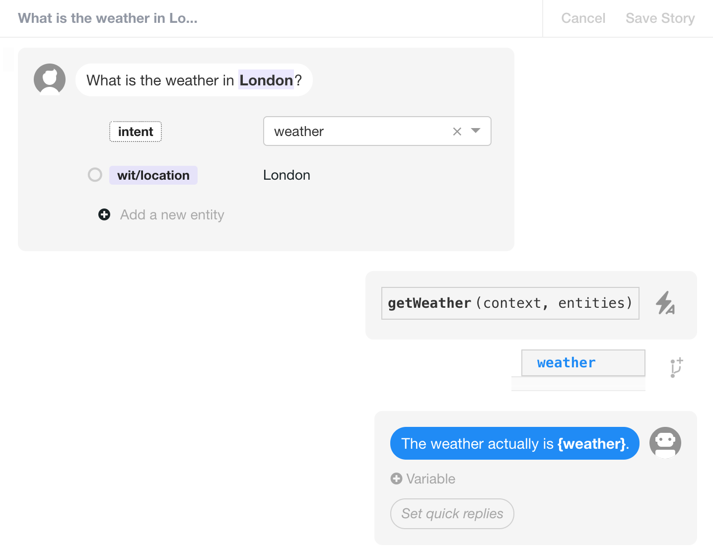
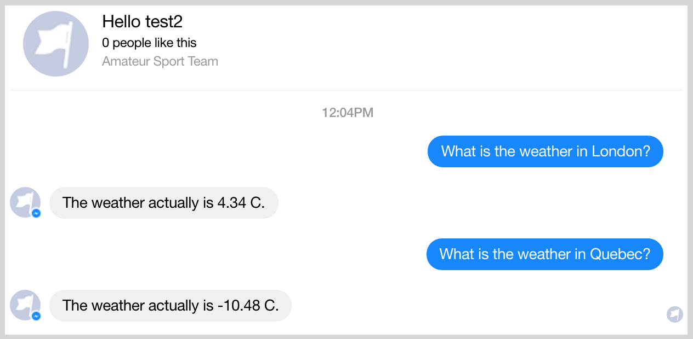

# Tutorial

This tutorial will show you how easy it is to build a bot using the Messenger and Wit.ai modules. For this purpose, we will build a bot from scratch and we will end up with a simple weather bot in about 30 minutes. If run into problems, do not hesitate to talk to us on our [Slack Community](https://slack.botpress.io); it will be a pleasure for us to answer your requests.

If you don't want to follow our step-by-step guide, you can clone this repository and just try it by linking it to a Facebook page (Step #6) and your Wit.ai account (Step #7). If you clone this repository, don't forget to run `npm install` in your cloned repository.

## Table of contents
* [Requirements](#requirements)
* [Step-by-step](#step-by-step)
	* [Install Botpress](#install-botpress)
	* [Create a new repository](#create-new-repo)
	* [Initialize Botpress](#initialize-botpress)
	* [Install Botpress modules](#install-botpress-modules)
	* [Start Botpress](#start-botpress)
	* [Configure Messenger connection settings](#configure-messenger)
		* [Verifying your configuration](#verifying-connection)
	* [Configure your Wit.ai account](#configure-wit)
	* [Select Wit.ai mode](#select-wit-mode)
	* [Create a story](#create-story)
	* [Open your repo in an editor](#open-repo-editor)
	* [Implement the getWeather() action](#implement-getweather)
	* [Chat with your bot](#chat-with-bot)
* [Have fun](#have-fun)
* [Community](#community)
* [License](#license)

## Requirements<a name="requirements"></a>

Botpress requires [node](https://nodejs.org) (version >= 4.2) and uses [npm](https://www.npmjs.com) as package manager.

## Step-by-step<a name="step-by-step"></a>

### 1. Install Botpress<a name="install-botpress"></a>

You need to have `botpress` installed as a general dependency using `npm`. If it's already done, you only need to install it using the following command (make sure to install it globally).

```
npm install -g botpress
```

### 2. Create a new repository<a name="create-new-repo"></a>

Once `botpress` has been installed, you need to create a new repository and cd into it.

```js
mkdir wit-bot && cd wit-bot // Mac and Linux users

md wit-bot && cd wit-bot // Windows users
```

### 3. Initialize Botpress<a name="initialize-botpress"></a>

Now, let's use the command line interface to initialize your bot. You need to run the following command.

```
botpress init
```

### 4. Install Botpress modules<a name="install-botpress-modules"></a>

Directly in your command line again, you need to install the [botpress-messenger](https://github.com/botpress/botpress-messenger) module to connect your bot to a Facebook page. Also, make sure to install the [botpress-wit](https://github.com/botpress/botpress-wit) module to connect our bot to your Wit.ai account.

```
botpress install messenger wit
```

### 5. Start Botpress<a name="start-botpress"></a>

Once you have everything installed, you can start your bot and see what it includes.

```
botpress start
```

Go to http://localhost:3000 and from there you can install other modules as desired, but for this tutorial we only need `botpress-messenger` and `botpress-wit` which are supposed to already be installed.

### 6. Configure Messenger connection settings<a name="configure-messenger"></a>

Before starting to code, you need to configure Messenger so it's connected directly to your Facebook page. If this is your first time to configure Messenger, we recommend following our [getting started guide](https://docs.botpress.io/getting-started.html) in the official Botpress documentation.


Briefly, you only need to create a [Facebook page](https://www.facebook.com/pages/create) if you don't already have one. You also need to create a new [Messenger app](https://developers.facebook.com/) on Facebook. After that, you should find your **App ID**, **App Secret**, and **Token Access**, and paste them directly into the `botpress-messenger` module settings of the [Botpress user interface](http://localhost:3000/modules/botpress-messenger) running locally. Finally, you only need to activate [**ngrok**](https://ngrok.com/), **validate**, and **connect** your bot.

For further information on configuring `botpress-messenger` see the [Getting Started documentation](https://docs.botpress.io/getting-started.html).

#### Verifying your configuration<a name="verifying-connection"></a>

After connecting the Botpress Messenger module with your Facebook Messenger app in the step above, you can verify that everything's working by opening a chat tab on your Facebook page and typing `BOT_LICENSE`.

The bot should answer your user message, for example with:

```
Bot: motivation-bot
Created by: GB
License: AGPL-3.0
Botpress: 0.0.50
```

**Note**: `BOT_LICENSE` is a Botpress command to display basic information about your bot (name, version, licenses).


### 7. Configure your Wit.ai account<a name="configure-wit"></a>

The next step is to link your `botpress-wit` module to your Wit.ai account. To do this, you only need to fill the **Access token** field in the user interface of the module.


First, you need to create an account on the [Wit.ai homepage](http://www.wit.ai) if you don't already have one. Once your account is created, you now have to create a new application on Wit.ai. By default however, if you just created your account, an application should automatically be created for you (MyFirstApp).

Click on **Settings** and then look in the **API Details** panel to copy your `Server Access Token`.


### 8. Select Wit.ai mode<a name="select-wit-mode"></a>

Next, you need to switch the mode in the `botpress-wit` module from Understanding to Stories by selecting the **Stories** checkbox.


- Understanding mode will inject understanding metadata inside incoming messages through the Wit.ai middleware. Events will have a wit property populated with the extracted entities and the context.

- Stories mode will run your Wit.ai stories automatically given that you defined the Actions in botpress. For more information about Actions and how they are run, make sure to read [node-wit's documentation](https://github.com/wit-ai/node-wit).

### 9. Create a story<a name="create-story"></a>

You will need to create a new story or interaction in your Wit.ai account. We will begin by creating a simple "hello world" story to test if everything works. You can create your own interaction to test the bot if you want to. (Do make sure to click **Save story** when done.)


If everything works fine, your bot should respond appropriately when you type `Hello!` on [Messenger](https://www.messenger.com/) or [Facebook](https://www.facebook.com).


**Note**: From here, if you want to only build a conversation using Wit.ai, you have everything you need without having to have code anything.

### 10. Add a weather action<a name="add-weather-action"></a>

Now that we have a basic "hello world" conversation, we want to ask about the weather. To do that, we need to add some basic interactions where we ask Wit.ai to call our action `getWeather()`.

We do this by adding another story or interaction as shown below. Make sure to specify the `wit/location` entity. When entering the **weather** context, you can leave the **context-key** field blank.



### 11. Open your repo in an editor<a name="open-repo-editor"></a>

Once you've set up these two interactions in Wit.ai, you need to implement this action in your bot. To do this, open your repository in your code editor (Sublime, Atom, WebStorm, Netbeans, ...). As you can see, some files and directories have already been created when you had previously initialized the repo with `botpress init`:

```js
- botfile.js // your bot's configuration
- index.js // your bot's entry point. the bot logic goes here
- package.json // regular node package.json file
- LICENSE // your bot license, either AGPLv3 or Botpress License
- .gitignore // ignore some botpress-created files by default
```

### 12. Implement the `getWeather()` action<a name="implement-getweather"></a>

Now, open `index.js` and write (or paste) the following lines of code. We want to implement `getWeather()` and add `weather` to our `context` object. To do that, we call an external API to get the weather and we return a modified `context` object to Wit.ai.

```js
var syncRequest = require('sync-request');

const getRequestAPI = (location, units) => {
  const OPEN_WEATHER_API_KEY = '<YOUR_API_KEY>'
  return "http://api.openweathermap.org/data/2.5/weather?" +
    "q=" + location +
    "&units=" + units +
    "&appid=" + OPEN_WEATHER_API_KEY
}

module.exports = function(bp) {
  bp.middlewares.load()

  // Implement your Actions like this
  bp.wit.actions['getWeather'] = request => {
    return new Promise((resolve, reject) => {

      // Get location from entities
      const location = request.entities.location[0].value

      //Get temperature from API
      const requestAPI = getRequestAPI(location, 'metric')
      const res = JSON.parse(syncRequest('GET', requestAPI).body);
      const temperature = res.main.temp

      request.context.weather = temperature + ' C'
      resolve(request.context)
    })
  }

  // You need to call this method once you are done implementing the Actions
  bp.wit.reinitializeClient()
}
```

**Note 1**: If you want to run this bot, you will need to register with [OpenWeatherMap](http://api.openweathermap.org/) and get your own `<YOUR_API_KEY>`.

**Note 2**: Make sure the npm module `sync-request` is installed before running the above code.

### 13. Chat with your bot<a name="chat-with-bot"></a>

Once everything is done, you should now be able to chat with your bot and ask him about current weather at the location you want.



**Note**: Here we only implemented a basic interaction. But with our `botpress-wit` module you can achieve far more. Now it's your turn to implement your own actions using Wit.ai to build conversations. And in doing so, you will build an **awesome** bot.

## Have fun<a name="have-fun"></a>

Building a bot with botpress is as simple as that! In fact, it took us only a relatively short amount of time to do everything (code and tutorial).

Feel free to fork our bot, send pull requests, clone it, send comments, etc.

## Community<a name="community"></a>

Pull requests are welcome! We believe that it takes all of us to create something big and impactful.

There's a [Slack community](https://slack.botpress.io) where you are welcome to join us, ask any question, and even help others.

Get an invite to join us now! 👉[https://slack.botpress.io](https://slack.botpress.io).

## License<a name="license"></a>

`wit-bot` is licensed under [AGPL-3.0](/LICENSE).